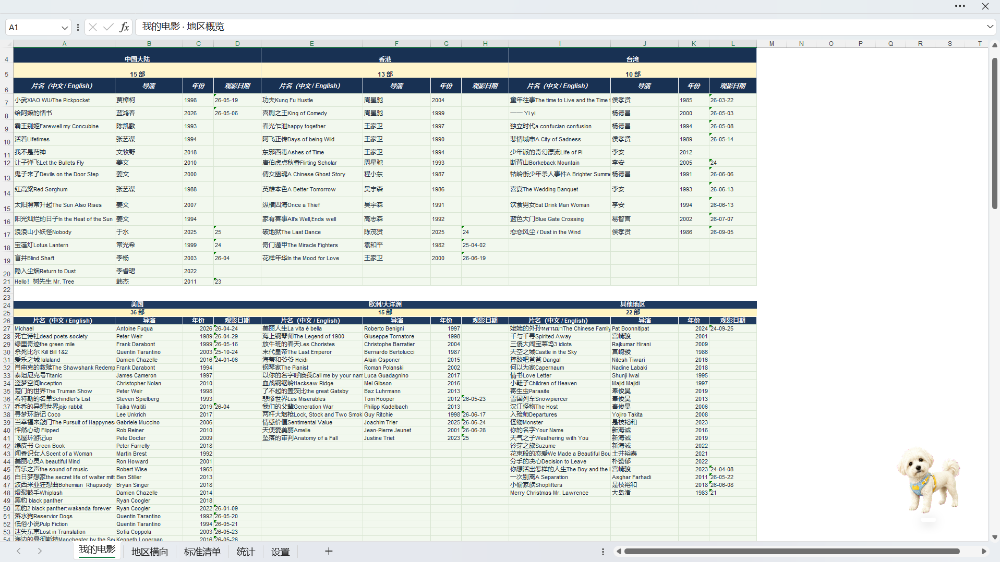

# Movie to Excel

Movie to Excel is an open-source, local-first Codex plugin that turns a movie title or poster into a private Excel viewing archive. The workbook stays on the user's computer; internet access is used only to identify a movie and verify public metadata.



## Why this project

Movie to Excel is not intended to compete with Douban as a film platform. Douban already provides movie records, ratings, reviews, social features, and a large user community. This project does not attempt to reproduce those advantages. Its purpose is narrower: it lets you build and maintain a viewing archive that belongs entirely to you, stays as a local Excel file on your computer, and remains easy to search, edit, back up, or move without depending on a social platform.

## 为什么做这个项目

Movie to Excel 并不打算取代豆瓣。豆瓣已经拥有完善的电影条目、评分、评论、社交功能和庞大的用户群，这些都不是本项目的优势。本项目只专注于一件更小、更私人的事情：让用户在自己的电脑上建立一份完全属于自己的本地观影记录。它以 Excel 文件保存，可以随时查询、修改、备份和迁移，不依赖社交平台，也不需要公开自己的观影历史。

## What it does

Give Codex a movie title, poster, or screenshot. The plugin resolves the exact film, verifies its Chinese and official English titles, director, year, production region, genre, and source, then creates or updates a local `.xlsx` archive. It detects likely duplicates and keeps personal ratings and notes private.

The included workbook offers a region overview, a complete horizontal region layout, and a searchable standard list. `标准清单` is the single source of truth, so presentation can change without losing records.

## Install from GitHub

```text
codex plugin marketplace add wanzhonggu473-kuuu/movie-to-excel --ref main
```

Then open the Plugins Directory in the ChatGPT desktop app, choose the **Movie to Excel** marketplace, and install **movie-to-excel**. GitHub marketplace sources and the required repository layout follow the official [OpenAI plugin packaging documentation](https://developers.openai.com/plugins/build/plugins).

## Use

Examples of natural requests:

```text
Add A City of Sadness to my movie archive. I watched it today.
```

```text
Identify this poster and add the movie to my existing Excel archive. My rating is 8.5.
```

If a title is ambiguous, the plugin asks for the year or version before writing. A viewing date supplied by the user always wins, including an earlier date. If the user only says they watched it before, the plugin does not guess a date; if no date is supplied at all, it uses the current local date and states that assumption.

## Workbook structure

- `我的电影`: complete region overview, with Mainland China, Hong Kong, and Taiwan on the first row and the United States, Europe/Oceania, and other regions on the second. Each region lists all of its records.
- `地区横向`: complete horizontal region layout.
- `标准清单`: searchable and sortable list.
- `统计`: local totals by region.
- `设置`: presentation, language, date, and lookup preferences.

Titles appear as `中文名 / Official English Title` in grouped views. Directors use established Chinese names for productions from Mainland China, Hong Kong, or Taiwan; all other productions use full English or romanized names.

## Privacy

There are no accounts, public profiles, followers, likes, feeds, analytics, or cloud-hosted viewing histories. Ratings and private notes remain inside the local workbook. See [SECURITY.md](SECURITY.md) for the data boundary.

## Repository layout

```text
.agents/plugins/marketplace.json
plugins/movie-to-excel/
├── .codex-plugin/plugin.json
├── assets/movie-archive-template.xlsx
├── examples/verified-movie.example.json
├── scripts/
└── skills/movie-to-excel/
```

## Development status

Version `0.5.0` is an early working prototype. Title-based identification, region classification, duplicate detection, workbook updates, and synchronized views have been exercised end to end. Poster-identification tests, configurable region rules, larger database capacity, and easier non-Codex installation remain on the roadmap.

## Contributing and license

Contributions are welcome; read [CONTRIBUTING.md](CONTRIBUTING.md) before opening a pull request. Movie to Excel is released under the [MIT License](LICENSE).
