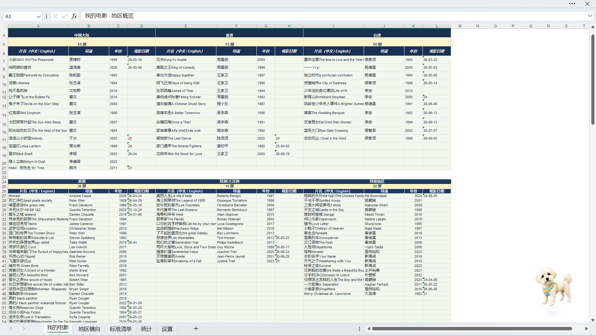
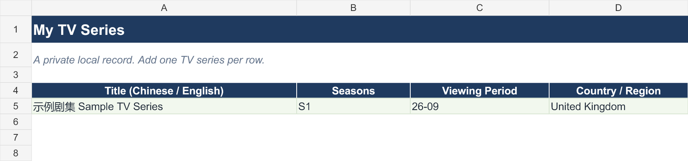
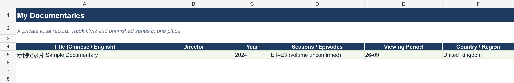

# Movie to Excel

Movie to Excel is a local-first Codex plugin for keeping a private Excel archive of movies, TV series, and documentaries. Give Codex a title or poster and, after identifying the work, it can add a record to a workbook on your computer. Public metadata lookup may use the internet; your viewing history stays in the local file.



**New here?** Follow the [first-use walkthrough](#first-use). This is a Codex plugin that writes a local Excel file; it is not an add-in inside Microsoft Excel.

## Why this project

Movie to Excel does not try to compete with Douban's ratings, reviews, social features, or community. Its purpose is to let you own a simple, searchable record that you can edit, back up, and move as an ordinary Excel file.

## 为什么做这个项目

Movie to Excel 不打算复制豆瓣的评分、评论、社交功能或用户社区。它的重点是让你在自己的电脑上保存一份可查询、可修改、可备份和迁移的观影记录。联网只用于核对公开的作品资料；个人观看历史保存在本地 Excel 文件中。

## Workbook

The included [blank template](plugins/movie-to-excel/assets/movie-archive-template.xlsx) has seven sheets:

| Sheet | Purpose |
| --- | --- |
| `My Movies` | All movies grouped across two rows of production regions. The lower row moves down when the upper groups grow. |
| `Region View` | Six horizontal region lists, each with a director filter. Europe/Oceania and Other Regions also have country filters. |
| `Master List` | The authoritative, searchable movie list, including optional private rating and notes. |
| `Statistics` | Local movie totals by region. |
| `Settings` | The workbook's display and date conventions. |
| `My TV Series` | Series title, watched seasons, viewing period, and country/region. |
| `My Documentaries` | Documentary title, director, year, seasons/episodes watched, viewing period, and country/region. |

Grouped titles show the Chinese title before the official English or original title. For Mainland China, Hong Kong, and Taiwan films, directors use their established Chinese names; for other films, directors use full English or romanized names. A documentary series may have different episode directors, so its director field can remain blank when no single verified director applies.

## New: TV series and documentaries / 新增：电视剧与纪录片

`My TV Series` records the seasons you actually watched, the viewing period (normally to the month), and the country or region. A single season is written as `S1`; more seasons can be added later to the same entry. Titles use Chinese first, followed by the official English or original title. You can simply say that a title is a TV series and provide its name, seasons, and viewing period.

`My Documentaries` is a separate list for documentaries and documentary series. It can record a director when one is verified, release year, watched seasons or episodes, viewing period, and country or region. Watching three episodes is recorded as progress such as `E1–E3`, not as completion of the whole series. If a volume or season is uncertain, the record says so rather than guessing. Later viewing updates the existing entry instead of creating another row.

`My TV Series` 用来记录实际看过的季数、观看时期（通常精确到月份）和国家或地区。只看过一季就写 `S1`，以后继续观看可以更新同一条记录。片名先写中文名，再写官方英文名或原名。告诉 Codex“这是电视剧”，再提供名称、季数和观看时期即可。

`My Documentaries` 单独保存纪录片和纪录剧集，可记录核实过的导演、年份、实际看过的季或集、观看时期及国家或地区。比如只看了前三集，就记作 `E1–E3`，不会误写成整季看完；不确定属于哪一卷或哪一季时，会保留“不确定”。以后继续看时更新原条目，不重复新增一行。

These screenshots contain fictional sample entries. The downloadable template is empty and contains no one's viewing history. / 以下截图使用虚构示例；下载的模板是空白的，不含任何人的观影记录。





## Recording rules / 记录规则

- If the user does not explicitly say “TV series” or “documentary,” treat the title as a movie. / 没有明确说“电视剧”或“纪录片”时，默认按电影处理。
- Append a newly watched title to the end of its movie region or series list. For an existing series, update its progress in the same row. / 新条目追加到对应分类末尾；继续观看同一剧集时更新原行的进度。
- Keep the viewing date or period at the precision the user provides: `26-09-28`, `26-09`, `26`, `2609`, or a range. Blank means unknown. When no movie date is supplied at all, use today's local date and state that assumption. / 按用户提供的精度记录日期；不知道时留空，完全没说电影观影日期时才默认今天并说明。
- Record documentary episodes without claiming the whole season was finished. If the volume is unclear, preserve that uncertainty. / 纪录片只记录实际看过的集数，卷数不明就标注待确认。
- The owner can name the active workbook `观影记录-YYMMDD.xlsx`, where the suffix is its last modification date. Writers accept an explicit output path or an authorized `--in-place` update. / 文件名可以显示最后修改日期；更新同一天的文件可以原位写入。

## First use

第一次使用：约五分钟（不含首次安装 Codex 的时间）。

You need the Codex desktop app (or a Codex installation with plugin support) and a spreadsheet program such as Microsoft Excel or LibreOffice to view the result. You do **not** need a GitHub account or programming experience. The first setup may take longer than five minutes if Codex is not installed yet. / 需要能使用插件的 Codex，以及 Excel 或 LibreOffice 等表格软件。无需 GitHub 账号或编程经验；如果还没有安装 Codex，首次准备可能超过五分钟。

1. **Install the plugin / 安装插件。** In a terminal, run the command below. Then open Codex's **Plugins Directory**, choose the **Movie to Excel** marketplace, and install **movie-to-excel**. If the marketplace does not appear, restart Codex. This adds the plugin to Codex; it does not create your personal workbook yet. / 在终端运行下方命令，然后到 Codex 的插件目录找到 **Movie to Excel** 并安装 **movie-to-excel**。如果没有出现，重启 Codex。这一步只安装插件，不会自动生成你的私人表格。

   ```text
   codex plugin marketplace add wanzhonggu473-kuuu/movie-to-excel --ref main
   ```

   If `codex` is not recognized, open this GitHub page, click **Code → Download ZIP**, unzip it, open that folder as a project in Codex, and restart Codex. Its `.agents/plugins/marketplace.json` file makes the local marketplace discoverable. / 如果电脑提示找不到 `codex` 命令，可以在本页点 **Code → Download ZIP**，解压后把该文件夹作为项目在 Codex 中打开，再重启 Codex。

2. **Make your own file / 建立自己的文件。** Download the [blank Excel template](plugins/movie-to-excel/assets/movie-archive-template.xlsx) (on GitHub, open the link and choose **Download raw file**). If you used **Download ZIP**, the template is already in the extracted `plugins/movie-to-excel/assets/` folder. Put a copy somewhere easy to find, such as your Desktop, and rename it `My Viewing Archive.xlsx`. Open it once to confirm you see tabs including `My Movies`, `My TV Series`, and `My Documentaries`. Keep this personal copy on your computer; do not upload it to GitHub. / 下载空白模板；如果已经下载并解压了 ZIP，模板就在 `plugins/movie-to-excel/assets/` 里，无需再次下载。把副本放在桌面等方便查找的位置，改名为 `My Viewing Archive.xlsx`。打开后应能看到上述工作表。私人副本不要上传到 GitHub。

3. **Add one movie / 录入一部电影。** In Codex, give the full path to your personal workbook (or attach the file), then send a request like the one below. Replace the path with the location of **your** file. Codex will verify the film and ask if the title is ambiguous. Check its proposed title, date, and region before allowing it to write. / 在 Codex 中提供私人表格的完整路径（或附上文件），发送类似下面的话。把路径换成你自己的；如果片名有歧义，Codex 会先询问。写入前核对片名、日期和地区。

   ```text
   Add the movie Inception to my local workbook at <full path to My Viewing Archive.xlsx>. I watched it on 26-09-05. Update this file, and tell me which row changed.
   ```

4. **Add one TV series / 录入一部电视剧。** In the same chat, explicitly say it is a TV series and give the season and viewing month. For example: / 在同一对话里明确说“电视剧”，并给出季数和观看月份，例如：

   ```text
   This is a TV series: Stranger Things. I watched S1 in 26-09. Add it to the same local workbook, then tell me which row changed.
   ```

5. **Open and check / 打开核对。** Open your personal workbook again. The film should appear in `Master List` and its region in `My Movies` and `Region View`; the series should appear in `My TV Series`. If Codex saved an updated copy instead of replacing the original, open the output path it reports and keep that as your active file. Close the workbook in Excel before asking Codex to update it again, to avoid a file-lock error. / 重新打开私人表格：电影应出现在 `Master List` 和对应地区，电视剧应出现在 `My TV Series`。若 Codex 另存了更新版，就打开它报告的路径，并把那份作为今后使用的文件。再次更新前先在 Excel 里关闭该文件，以免被占用。

For a documentary, say so explicitly and provide only the episodes or seasons you watched. For example: `This is a documentary series. I watched E1–E3 in 26-09; the volume is uncertain. Add it to the same workbook without marking the whole series complete.` It should appear in `My Documentaries`. / 纪录片也要明确说明类别，并只提供实际看过的集数或季数；不确定的卷数可以直说“不确定”，不要当作整季看完。

If nothing changed, first check that Codex reported the **same file path** you opened, that the plugin is installed, and that Excel has released the file. / 如果看不到更新，先核对 Codex 报告的文件路径是否与你打开的是同一份、插件是否已安装，以及 Excel 是否仍占用文件。

## More examples

Examples:

```text
Add A City of Sadness to my movie archive. I watched it on 26-09-05.
```

```text
Add this poster as a movie. I only remember watching it in 2025.
```

```text
Add this TV series: season 1, watched in September 2026.
```

```text
Add this Netflix documentary series. I watched episodes 1–3 from 26-09-28 to 26-09-30, but I do not know the volume.
```

For direct script use, pass verified metadata in a JSON file:

```text
node plugins/movie-to-excel/scripts/add-movie.mjs --input my-archive.xlsx --output updated-archive.xlsx --movie-file verified-movie.json
node plugins/movie-to-excel/scripts/add-series.mjs --type documentary --input my-archive.xlsx --output updated-archive.xlsx --record-file verified-documentary.json
```

Use `--type tv` for a TV series. Use `--update-existing` when adding more episodes or seasons to an existing entry. `--in-place` is required to overwrite the input workbook. For a fresh archive, copy the blank template and choose an output filename. The `add-movie.mjs` writer detects a likely duplicate by title and year; `--allow-duplicate` is reserved for intentional repeat viewings.

## Privacy and development

The repository includes an empty workbook template. Personal archives belong in `outputs/` or another local folder; `outputs/` and `personal-archives/` are ignored by Git. There are no accounts, public profiles, followers, feeds, or cloud-hosted viewing histories. See [SECURITY.md](SECURITY.md) for the data boundary.

Version `0.6.0` covers local movie, TV, and documentary recording. Movie metadata and workbook views are synchronized by the scripts. Poster identification still depends on the assistant's verification, and country/region classification may require a judgment for international co-productions. Contributions are welcome; see [CONTRIBUTING.md](CONTRIBUTING.md). The project uses the [MIT License](LICENSE).
